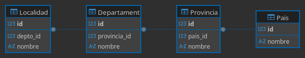

# Carga de datos csv a sqlite.

Se adjuntan 4 archivos .csv (comma separated values)

- ign-pais.csv
- provincias.csv
- departamentos.csv
- localidades.csv

## Bajar sqlite.

En [ésta](https://sqlite.org/2026/sqlite-tools-win-x64-3510300.zip) url bajar el archivo sqlite-tools-win-x64-3510300.zip.

Descomprimirlo en una carpeta a elección. Tiene 4 archivos. El único que usaremos es el
que se llama **sqlite3.exe**.

## En la consola cmd.

Abriendo la consola cmd, nos movemos a la carpeta donde pusimos los csv adjuntos y el sqlite3.exe.

```
juan@lenovo:~/dev/geo/data$ ls -l
total 792
-rw-rw-r-- 1 juan juan  71235 Sep 11  2025 departamentos.csv
-rw-rw-r-- 1 juan juan  38258 Aug  9  2019 ign-pais.csv
-rw-rw-r-- 1 juan juan 678036 Sep 10  2025 localidades.csv
-rw-rw-r-- 1 juan juan   2830 Sep 11  2025 provincias.csv
-rw-rw-r-- 1 juan juan    511 Apr  2 16:11 teoria.md
-rw-rw-r-- 1 juan juan   2623 Apr  2 15:20 todo.sql
-rwxrwxr-x 1 juan juan    525 Apr  2 15:47 urls.bat
```

En mi caso, la terminal de linux es la consola.

En la consola de Windows lo que se vé es distinto.

Vemos:

- Los 4 archivos csv
- El archivo de comandos urls.bat
- El archivo todo.sql que hace desde la importacion de los csv hasta la creación y carga de las tablas
  finales.
- teoria.md (Este archivo, despues agregaré una version en pdf)

# Empezamos!!!

## Crear la base de datos.

```
juan@lenovo:~/dev/geo/data$ sqlite3 Geo.db
SQLite version 3.46.1 2024-08-13 09:16:08
Enter ".help" for usage hints.
sqlite>

```

## Ejecutar el archivo **todo.sql**

```
juan@lenovo:~/dev/geo/data$ sqlite3 Geo.db
SQLite version 3.46.1 2024-08-13 09:16:08
Enter ".help" for usage hints.
sqlite> .read todo.sql
┌────┬───────────────────────────────────────────────────────┬─────────────┐
│ id │                        nombre                         │ Localidades │
├────┼───────────────────────────────────────────────────────┼─────────────┤
│ 1  │ BUENOS AIRES                                          │ 501         │
│ 2  │ CATAMARCA                                             │ 126         │
│ 3  │ CHACO                                                 │ 85          │
│ 4  │ CHUBUT                                                │ 69          │
│ 6  │ CORRIENTES                                            │ 75          │
│ 7  │ CóRDOBA                                               │ 406         │
│ 8  │ ENTRE RíOS                                            │ 161         │
│ 9  │ FORMOSA                                               │ 61          │
│ 10 │ JUJUY                                                 │ 142         │
│ 11 │ LA PAMPA                                              │ 86          │
│ 12 │ LA RIOJA                                              │ 71          │
│ 13 │ MENDOZA                                               │ 134         │
│ 14 │ MISIONES                                              │ 131         │
│ 15 │ NEUQUéN                                               │ 53          │
│ 16 │ RíO NEGRO                                             │ 135         │
│ 17 │ SALTA                                                 │ 118         │
│ 18 │ SAN JUAN                                              │ 68          │
│ 19 │ SAN LUIS                                              │ 78          │
│ 20 │ SANTA CRUZ                                            │ 26          │
│ 21 │ SANTA FE                                              │ 345         │
│ 22 │ SANTIAGO DEL ESTERO                                   │ 150         │
│ 23 │ TIERRA DEL FUEGO, ANTáRTIDA E ISLAS DEL ATLáNTICO SUR │ 1           │
│ 24 │ TUCUMáN                                               │ 73          │
└────┴───────────────────────────────────────────────────────┴─────────────┘
sqlite>  .tables
Departamento  Localidad     Pais          Provincia
sqlite> .schema Pais
CREATE TABLE Pais (
       id integer primary key autoincrement,
       nombre varchar(256) not null unique);

sqlite> .schema Provincia
CREATE TABLE Provincia (
       id integer primary key autoincrement,
       pais_id integer not null,
       nombre varchar(256) not null,
    constraint fk_pais_provincia foreign key (pais_id) references Pais(id),
    constraint uq_provincia_pais unique(pais_id, nombre));

sqlite> .schema Departamento
CREATE TABLE Departamento (
       id integer primary key autoincrement,
       provincia_id integer not null,
       nombre varchar(256) not null,
    constraint fk_depto_provincia foreign key (provincia_id) references Provincia(id),
    constraint uq_provincia_depto unique(provincia_id, nombre));

sqlite> .schema Localidad
CREATE TABLE Localidad (
       id integer primary key autoincrement,
       depto_id integer not null,
       nombre varchar(256) not null,
    constraint fk_local_depto_id foreign key (depto_id) references Departmento(id),
    constraint uq_depto_localidad unique(depto_id, nombre));
```

Si todo anduvo bien, tenemos las tablas Pais, Provincia, Departamento y Localidad
cargadas con las relaciones correspondientes.

En todo momento, ante el prompt sqlite> .help tiene toda la info que podamos necesitar para
trabajar.



# Análisis del archivo **todo.sql**

Esto es lo que vamos a ver en clase la semana que viene.

Por favor ténganlo listo para trabajar.
Hay qur bajar sqlite e instalar dbeaver community edition.

## Saludos!
